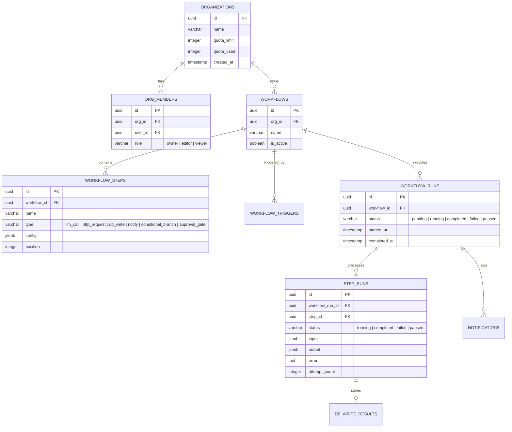

# AI Agent Workflow Builder (Mini n8n for AI)

A production-grade, full-stack workflow automation builder designed specifically for chaining AI agent steps with dual-layer security. Built on **Nhost** (PostgreSQL + Hasura + Auth + Storage + Serverless Functions) and **Next.js** (React + Webpack + Apollo Client v3).

This project replicates core workflow automation features (like n8n/Zapier) adapted for AI orchestration, supporting:
- Multi-step pipelines (LLM calls, custom HTTP requests, database logging, alerts, branches, approval gates).
- Live execution tracking via GraphQL WebSockets.
- Hardened multi-tenant access control and database-level security triggers.

---

## 📂 Project Directory Structure

```text
voacllabs/
├── nhost/
│   ├── migrations/      # PostgreSQL migrations defining database tables, views, and triggers
│   ├── metadata/        # Hasura metadata (tables, relationships, permissions, and custom actions)
│   └── nhost.toml       # Nhost services runtime configuration (Hasura, Auth, Storage)
├── functions/           # Node.js TypeScript Serverless Functions (Backend Runner)
│   ├── runner.ts        # Core step-by-step workflow execution engine (runner)
│   ├── utils.ts         # GraphQL client, template resolver, and exponential-backoff retrier
│   ├── triggerWorkflowRun.ts  # Webhook handler for triggerWorkflowRun Hasura Action
│   ├── approveStep.ts   # Webhook handler for approveStep Hasura Action (Layer 2 checking & resumption)
│   ├── slackNotify.ts   # Webhook handler for public.notifications Event Trigger
│   ├── dbEventTrigger.ts # Webhook handler for public.watched_events Event Trigger (automated runs)
│   └── package.json     # Node.js dependencies for Serverless Functions
└── frontend/            # Next.js React SPA (Frontend Client Dashboard)
    ├── src/app/         # Next.js App Router files (globals.css, layout.tsx, login/page.tsx, page.tsx)
    ├── src/components/  # Frontend UI wrappers (ApolloWrapper.tsx)
    ├── package.json     # Next.js frontend dependencies (Apollo Client v3, Lucide, Tailwind CSS)
    └── next.config.ts   # Next.js bundler and compiler configurations
```

---

## 📊 Database Schema & Data Model

The application uses PostgreSQL tables to model the multi-tenant workflow builder. The complete database schema is described below.



---

## 🔐 Dual-Layer Security Design

We implemented a zero-trust model consisting of two distinct protection boundaries:

### Layer 1: Role-Based Row Level Security (RLS)
Managed by **Hasura RLS**. All selects, updates, and deletes are scoped using session variables:
- **Scoping**: Row filters enforce that `org_members.user_id = x-hasura-user-id`.
- **Permissions**:
  - `owner` / `editor`: Can create/update/delete workflows, trigger executions, and modify steps.
  - `viewer`: Read-only select query access. Cannot trigger workflow runs or make changes.

### Layer 2: Database Gating for Privilege Operations
To prevent low-privileged roles (like `viewer`) or malicious editors from crafting steps that could execute rogue API calls or alter databases, Postgres triggers block modifications at the table level:
- Creating/modifying high-privilege steps (`db_write`, `notify`) or triggers (`webhook`) is blocked if the transaction session's `x-hasura-role` is not `owner`.
- Approving paused step runs (resuming executions at the `approval_gate`) requires the calling session token to have the `owner` or `editor` role, checked inside the `approveStep` serverless function.

---

## ⚙️ Core Serverless Code Implementation

Here is the complete codebase logic defining the resilient execution runner and security gating webhooks.

### 1. `functions/utils.ts` (GraphQL Client & Template Resolver)
[utils.ts](file:///c:/Users/ricky/Desktop/Voacllabs/functions/utils.ts)
Handles GraphQL interactions bypass RLS using the admin secret (since it executes tasks in the background), resolves inline double-bracket variable templates (e.g. `{{steps.StepName.output}}`), and implements exponential-backoff retries.

```typescript
import axios from 'axios';

const graphqlUrl = process.env.NHOST_GRAPHQL_URL || 'http://localhost:1337/v1/graphql';
const adminSecret = process.env.NHOST_ADMIN_SECRET || 'nhost-admin-secret';

export async function runGraphQL(query: string, variables: any = {}) {
  const response = await axios.post(
    graphqlUrl,
    { query, variables },
    {
      headers: {
        'x-hasura-admin-secret': adminSecret,
        'Content-Type': 'application/json',
      },
    }
  );
  if (response.data.errors) {
    throw new Error(JSON.stringify(response.data.errors));
  }
  return response.data.data;
}

export function resolveTemplate(template: string | object | any, context: any): any {
  if (template === null || template === undefined) return template;

  if (typeof template === 'string') {
    return template.replace(/\{\{([^}]+)\}\}/g, (match, path) => {
      const parts = path.trim().split('.');
      let current = context;
      for (const part of parts) {
        if (current == null) return '';
        current = current[part];
      }
      return current !== undefined ? (typeof current === 'object' ? JSON.stringify(current) : String(current)) : '';
    });
  }

  if (Array.isArray(template)) {
    return template.map(item => resolveTemplate(item, context));
  }

  if (typeof template === 'object') {
    const resolved: any = {};
    for (const key of Object.keys(template)) {
      resolved[key] = resolveTemplate(template[key], context);
    }
    return resolved;
  }

  return template;
}

export async function withRetries<T>(
  fn: (attempt: number) => Promise<T>,
  retries: number = 3,
  delayMs: number = 1000
): Promise<T> {
  let attempt = 1;
  let currentDelay = delayMs;
  while (true) {
    try {
      return await fn(attempt);
    } catch (error: any) {
      if (attempt >= retries) throw error;
      console.warn(`Attempt ${attempt} failed. Retrying in ${currentDelay}ms...`);
      await new Promise(resolve => setTimeout(resolve, currentDelay));
      attempt++;
      currentDelay *= 2;
    }
  }
}
```

### 2. `functions/runner.ts` (Resilient Step Engine)
[runner.ts](file:///c:/Users/ricky/Desktop/Voacllabs/functions/runner.ts)
The execution engine that processes workflow steps. Supports:
- **`llm_call`**: Resolves prompts, invokes Gemini Beta content API, and fails back to simulated outputs if no API key exists.
- **`http_request`**: Performs AXIOS calls with timeouts and retries.
- **`db_write`**: Writes resolved payload variables to the database.
- **`conditional_branch`**: Resolves operator logic and jumps step index indicators.
- **`approval_gate`**: Sets states to `paused` and interrupts execution safely.

```typescript
import axios from 'axios';
import { runGraphQL, resolveTemplate, withRetries } from './utils';

export async function executeWorkflowSteps(
  workflowRunId: string,
  workflowId: string,
  orgId: string,
  steps: any[],
  startFromIndex: number = 0,
  inputPayload: any = {}
) {
  const context: any = { input: inputPayload, steps: {} };

  if (startFromIndex > 0) {
    const completedQuery = await runGraphQL(`
      query GetCompletedStepRuns($workflow_run_id: uuid!) {
        step_runs(where: { workflow_run_id: { _eq: $workflow_run_id }, status: { _eq: "completed" } }) {
          step { name }
          output
        }
      }
    `, { workflow_run_id: workflowRunId });

    for (const sr of completedQuery.step_runs) {
      if (sr.step?.name) context.steps[sr.step.name] = { output: sr.output };
    }
  }

  await runGraphQL(`
    mutation UpdateWorkflowRunRunning($id: uuid!) {
      update_workflow_runs_by_pk(pk_columns: { id: $id }, _set: { status: "running" }) { id }
    }
  `, { id: workflowRunId });

  for (let i = startFromIndex; i < steps.length; i++) {
    const step = steps[i];
    let stepRunId = '';

    try {
      const existingStepRun = await runGraphQL(`
        query GetStepRun($workflow_run_id: uuid!, $step_id: uuid!) {
          step_runs(where: { workflow_run_id: { _eq: $workflow_run_id }, step_id: { _eq: $step_id } }) { id status }
        }
      `, { workflow_run_id: workflowRunId, step_id: step.id });

      if (existingStepRun.step_runs.length > 0) {
        stepRunId = existingStepRun.step_runs[0].id;
      } else {
        const createStepRun = await runGraphQL(`
          mutation CreateStepRun($workflow_run_id: uuid!, $step_id: uuid!, $input: jsonb!) {
            insert_step_runs_one(object: { workflow_run_id: $workflow_run_id, step_id: $step_id, status: "running", input: $input }) { id }
          }
        `, { workflow_run_id: workflowRunId, step_id: step.id, input: context });
        stepRunId = createStepRun.insert_step_runs_one.id;
      }

      await runGraphQL(`
        mutation UpdateStepRunRunning($id: uuid!) {
          update_step_runs_by_pk(pk_columns: { id: $id }, _set: { status: "running", error: null }) { id }
        }
      `, { id: stepRunId });

      let output: any = {};

      if (step.type === 'llm_call') {
        const apiKey = process.env.GEMINI_API_KEY;
        const resolvedPrompt = resolveTemplate(step.config.prompt || 'Hello', context);

        output = await withRetries(async (attempt) => {
          await runGraphQL(`
            mutation UpdateAttemptCount($id: uuid!, $attempt: integer!) {
              update_step_runs_by_pk(pk_columns: { id: $id }, _set: { attempt_count: $attempt }) { id }
            }
          `, { id: stepRunId, attempt });

          if (apiKey && apiKey !== 'YOUR_GEMINI_API_KEY') {
            const res = await axios.post(
              `https://generativelanguage.googleapis.com/v1beta/models/gemini-1.5-flash:generateContent?key=${apiKey}`,
              { contents: [{ parts: [{ text: resolvedPrompt }] }] }
            );
            return { text: res.data?.candidates?.[0]?.content?.parts?.[0]?.text?.trim() || '' };
          } else {
            await new Promise(resolve => setTimeout(resolve, 1500));
            return { text: resolvedPrompt.toLowerCase().includes('bad') ? 'negative' : 'positive' };
          }
        }, 3, 1000);
      } 
      
      else if (step.type === 'http_request') {
        output = await withRetries(async (attempt) => {
          const resolvedUrl = resolveTemplate(step.config.url || '', context);
          const method = step.config.method || 'GET';
          const res = await axios({
            method,
            url: resolvedUrl,
            headers: step.config.headers ? resolveTemplate(step.config.headers, context) : {},
            data: step.config.body ? resolveTemplate(step.config.body, context) : undefined,
            timeout: 8000
          });
          return { status: res.status, data: res.data };
        }, 3, 1000);
      } 
      
      else if (step.type === 'db_write') {
        const resolvedPayload = resolveTemplate(step.config.payload || {}, context);
        const dbRes = await runGraphQL(`
          mutation WriteDbResult($org_id: uuid!, $workflow_run_id: uuid!, $step_run_id: uuid!, $payload: jsonb!) {
            insert_db_write_results_one(object: { org_id: $org_id, workflow_run_id: $workflow_run_id, step_run_id: $step_run_id, payload: $payload }) { id }
          }
        `, { org_id: orgId, workflow_run_id: workflowRunId, step_run_id: stepRunId, payload: resolvedPayload });
        output = { success: true, row_id: dbRes.insert_db_write_results_one.id };
      } 
      
      else if (step.type === 'notify') {
        const resolvedMessage = resolveTemplate(step.config.message || 'Alert', context);
        const notifyRes = await runGraphQL(`
          mutation InsertNotification($org_id: uuid!, $workflow_run_id: uuid!, $message: String!) {
            insert_notifications_one(object: { org_id: $org_id, workflow_run_id: $workflow_run_id, message: $message }) { id }
          }
        `, { org_id: orgId, workflow_run_id: workflowRunId, message: resolvedMessage });
        output = { success: true, notification_id: notifyRes.insert_notifications_one.id };
      } 
      
      else if (step.type === 'conditional_branch') {
        const expression = resolveTemplate(step.config.expression || '', context);
        const targetValue = resolveTemplate(step.config.target_value || '', context);
        const conditionMet = expression.toLowerCase().includes(targetValue.toLowerCase());

        output = { conditionMet, expression, targetValue };

        if (!conditionMet && step.config.else_step_position !== undefined) {
          const elsePosition = parseInt(step.config.else_step_position);
          const nextIndex = steps.findIndex(s => s.position === elsePosition);
          if (nextIndex !== -1) {
            i = nextIndex - 1; // Fork execution position index
          }
        }
      } 
      
      else if (step.type === 'approval_gate') {
        await runGraphQL(`
          mutation PauseStepRun($id: uuid!) {
            update_step_runs_by_pk(pk_columns: { id: $id }, _set: { status: "paused" }) { id }
          }
        `, { id: stepRunId });

        await runGraphQL(`
          mutation PauseWorkflowRun($id: uuid!) {
            update_workflow_runs_by_pk(pk_columns: { id: $id }, _set: { status: "paused" }) { id }
          }
        `, { id: workflowRunId });
        return; // Halt thread
      }

      await runGraphQL(`
        mutation UpdateStepRunCompleted($id: uuid!, $output: jsonb!) {
          update_step_runs_by_pk(pk_columns: { id: $id }, _set: { status: "completed", output: $output }) { id }
        }
      `, { id: stepRunId, output });

      context.steps[step.name] = { output };

    } catch (err: any) {
      const errorMsg = err.message || String(err);
      if (stepRunId) {
        await runGraphQL(`
          mutation FailStepRun($id: uuid!, $error: String!) {
            update_step_runs_by_pk(pk_columns: { id: $id }, _set: { status: "failed", error: $error }) { id }
          }
        `, { id: stepRunId, error: errorMsg });
      }
      await runGraphQL(`
        mutation FailWorkflowRun($id: uuid!, $completed_at: timestamptz!) {
          update_workflow_runs_by_pk(pk_columns: { id: $id }, _set: { status: "failed", completed_at: $completed_at }) { id }
        }
      `, { id: workflowRunId, completed_at: new Date().toISOString() });
      return;
    }
  }

  await runGraphQL(`
    mutation CompleteWorkflowRun($id: uuid!, $completed_at: timestamptz!) {
      update_workflow_runs_by_pk(pk_columns: { id: $id }, _set: { status: "completed", completed_at: $completed_at }) { id }
    }
  `, { id: workflowRunId, completed_at: new Date().toISOString() });

  await runGraphQL(`
    mutation IncrementOrgQuota($org_id: uuid!) {
      update_organizations_by_pk(pk_columns: { id: $org_id }, _inc: { quota_used: 1 }) { id }
    }
  `, { org_id: orgId });
}
```

### 3. `functions/approveStep.ts` (Layer 2 Gate Verification Action)
[approveStep.ts](file:///c:/Users/ricky/Desktop/Voacllabs/functions/approveStep.ts)
Handles resumption of workflowRuns suspended at the `approval_gate`. Ensures only org `'owner'` or `'editor'` can trigger approvals.

```typescript
import { Request, Response } from 'express';
import { runGraphQL } from './utils';
import { executeWorkflowSteps } from './runner';

export default async function handler(req: Request, res: Response) {
  // Read session variables injected by Hasura
  const userId = req.body.session_variables['x-hasura-user-id'];
  const userRole = req.body.session_variables['x-hasura-role']; // 'admin' bypasses
  const { step_run_id } = req.body.input;

  try {
    // 1. Fetch step run details & workflow data
    const query = await runGraphQL(`
      query GetStepRunForApproval($id: uuid!) {
        step_runs_by_pk(id: $id) {
          id
          status
          workflow_run {
            id
            org_id
            workflow {
              id
              steps(order_by: { position: asc }) { id name type config position }
            }
            input_payload
          }
          step { position }
        }
      }
    `, { id: step_run_id });

    const stepRun = query.step_runs_by_pk;
    if (!stepRun || stepRun.status !== 'paused') {
      return res.status(400).json({ error: 'Step run is not paused or invalid.' });
    }

    const orgId = stepRun.workflow_run.org_id;

    // 2. Security Check: verify user membership and role in this org
    if (userRole !== 'admin') {
      const membershipQuery = await runGraphQL(`
        query GetUserMembership($org_id: uuid!, $user_id: uuid!) {
          org_members(where: { org_id: { _eq: $org_id }, user_id: { _eq: $user_id } }) {
            role
          }
        }
      `, { org_id: orgId, user_id: userId });

      const role = membershipQuery.org_members[0]?.role;
      if (role !== 'owner' && role !== 'editor') {
        return res.status(403).json({ error: 'Forbidden: Insufficient privileges.' });
      }
    }

    // 3. Set step run to completed
    await runGraphQL(`
      mutation CompleteApprovedStep($id: uuid!, $user_id: uuid!, $approved_at: timestamptz!) {
        update_step_runs_by_pk(
          pk_columns: { id: $id }
          _set: { status: "completed", approved_by: $user_id, approved_at: $approved_at, output: { approved: true } }
        ) { id }
      }
    `, { id: step_run_id, user_id: userId, approved_at: new Date().toISOString() });

    // 4. Resume execution thread asynchronously
    const steps = stepRun.workflow_run.workflow.steps;
    const currentPos = stepRun.step.position;
    const nextIndex = steps.findIndex((s: any) => s.position > currentPos);

    if (nextIndex !== -1) {
      executeWorkflowSteps(
        stepRun.workflow_run.id,
        stepRun.workflow_run.workflow.id,
        orgId,
        steps,
        nextIndex,
        stepRun.workflow_run.input_payload
      );
    } else {
      // Completed workflow run if no steps remain
      await runGraphQL(`
        mutation CompleteRun($id: uuid!, $completed_at: timestamptz!) {
          update_workflow_runs_by_pk(pk_columns: { id: $id }, _set: { status: "completed", completed_at: $completed_at }) { id }
        }
      `, { id: stepRun.workflow_run.id, completed_at: new Date().toISOString() });
    }

    return res.json({ success: true, status: 'completed' });
  } catch (err: any) {
    return res.status(500).json({ error: err.message });
  }
}
```

---

## 💻 Frontend Code Implementation

Below is the implementation logic for the Next.js Client App.

### 1. `frontend/src/components/ApolloWrapper.tsx` (WebSocket Client)
[ApolloWrapper.tsx](file:///c:/Users/ricky/Desktop/Voacllabs/frontend/src/components/ApolloWrapper.tsx)
Sets up the Nhost Providers and wraps Apollo Client to support queries over HTTP and subscriptions over Websockets (ws / wss).

```typescript
'use client';

import React, { useState } from 'react';
import { NhostClient, NhostNextProvider } from '@nhost/nextjs';
import { NhostApolloProvider } from '@nhost/react-apollo';
import { loadDevMessages, loadErrorMessages } from "@apollo/client/dev";

if (process.env.NODE_ENV !== 'production') {
  loadDevMessages();
  loadErrorMessages();
}

export function ApolloWrapper({ children }: { children: React.ReactNode }) {
  const [nhost] = useState(() => new NhostClient({
    subdomain: process.env.NEXT_PUBLIC_NHOST_SUBDOMAIN || 'local',
    region: process.env.NEXT_PUBLIC_NHOST_REGION || ''
  }));

  return (
    <NhostNextProvider nhost={nhost}>
      <NhostApolloProvider nhost={nhost}>
        {children}
      </NhostApolloProvider>
    </NhostNextProvider>
  );
}
```

### 2. `frontend/src/app/login/page.tsx` (Autosynced Login handler)
[page.tsx](file:///c:/Users/ricky/Desktop/Voacllabs/frontend/src/app/login/page.tsx)
Handles email verification checks correctly, showing a clean error alert or success verification state.

```typescript
'use client';

import React, { useState, useEffect } from 'react';
import { useSignInEmailPassword, useSignUpEmailPassword, useAuthenticationStatus } from '@nhost/react';
import { useRouter } from 'next/navigation';
import { Shield, Mail, Lock, User, RefreshCw, ArrowRight } from 'lucide-react';

export default function LoginPage() {
  const router = useRouter();
  const { isAuthenticated, isLoading: authLoading } = useAuthenticationStatus();
  
  const [isSignUp, setIsSignUp] = useState(false);
  const [email, setEmail] = useState('');
  const [password, setPassword] = useState('');
  const [name, setName] = useState('');
  const [errorMsg, setErrorMsg] = useState('');
  const [successMsg, setSuccessMsg] = useState('');

  const { signInEmailPassword, isLoading: isSigningIn } = useSignInEmailPassword();
  const { signUpEmailPassword, isLoading: isSigningUp } = useSignUpEmailPassword();

  const [isMounted, setIsMounted] = useState(false);
  useEffect(() => {
    setIsMounted(true);
  }, []);

  useEffect(() => {
    if (isMounted && isAuthenticated) {
      router.push('/');
    }
  }, [isAuthenticated, router, isMounted]);

  const handleSubmit = async (e: React.FormEvent) => {
    e.preventDefault();
    setErrorMsg('');
    setSuccessMsg('');

    if (!email || !password) {
      setErrorMsg('Please fill in all fields.');
      return;
    }

    try {
      if (isSignUp) {
        const res = await signUpEmailPassword(email, password, {
          displayName: name || email.split('@')[0],
          metadata: { name }
        });
        if (res.error) {
          setErrorMsg(res.error.message || 'Failed to sign up.');
        } else if (res.needsEmailVerification) {
          setSuccessMsg('Sign up successful! Please check your email to verify your account before logging in.');
        } else {
          router.push('/');
        }
      } else {
        const res = await signInEmailPassword(email, password);
        if (res.error) {
          setErrorMsg(res.error.message || 'Incorrect email or password.');
        } else if (res.needsEmailVerification) {
          setSuccessMsg('Please verify your email address. A verification link has been sent to your email.');
        } else {
          router.push('/');
        }
      }
    } catch (err: any) {
      setErrorMsg(err?.message || 'A connection or runtime error occurred.');
    }
  };

  if (!isMounted || authLoading) {
    return (
      <div className="flex h-screen w-screen items-center justify-center bg-slate-950 text-slate-100">
        <RefreshCw className="h-10 w-10 animate-spin text-indigo-500" />
      </div>
    );
  }

  return (
    <div className="flex min-h-screen items-center justify-center bg-slate-950 px-4">
      <div className="w-full max-w-md bg-slate-900 p-8 rounded-2xl border border-slate-800 shadow-2xl">
        <div className="text-center">
          <Shield className="mx-auto h-12 w-12 text-indigo-400" />
          <h2 className="mt-6 text-3xl font-extrabold text-white">{isSignUp ? 'Create account' : 'Sign In'}</h2>
        </div>
        <form className="mt-8 space-y-6" onSubmit={handleSubmit}>
          {errorMsg && <div className="rounded-lg bg-red-500/10 border border-red-500/20 p-3 text-red-400 text-sm">{errorMsg}</div>}
          {successMsg && <div className="rounded-lg bg-emerald-500/10 border border-emerald-500/20 p-3 text-emerald-400 text-sm">{successMsg}</div>}
          
          <div className="space-y-4">
            {isSignUp && (
              <input type="text" placeholder="Name" value={name} onChange={(e) => setName(e.target.value)} required className="block w-full rounded-lg bg-slate-950 border border-slate-800 px-3 py-3 text-white focus:outline-none" />
            )}
            <input type="email" placeholder="Email" value={email} onChange={(e) => setEmail(e.target.value)} required className="block w-full rounded-lg bg-slate-950 border border-slate-800 px-3 py-3 text-white focus:outline-none" />
            <input type="password" placeholder="Password" value={password} onChange={(e) => setPassword(e.target.value)} required className="block w-full rounded-lg bg-slate-950 border border-slate-800 px-3 py-3 text-white focus:outline-none" />
          </div>

          <button type="submit" disabled={isSigningIn || isSigningUp} className="w-full flex justify-center py-3 bg-indigo-600 hover:bg-indigo-500 text-white rounded-lg font-semibold disabled:opacity-50">
            {isSignUp ? 'Get Started' : 'Sign In'}
          </button>
        </form>
      </div>
    </div>
  );
}
```

---

## 📦 Local Setup Instructions

Follow these steps to set up the workspace locally:

### 1. Prerequisites
- **Node.js**: Version 18 or higher.
- **npm / yarn**: Installed.

### 2. Dependencies Installation
Install dependencies inside the `/frontend` and `/functions` folders:
```bash
# Setup frontend packages (using legacy peer deps to resolve Apollo conflicts)
cd frontend
npm install --legacy-peer-deps

# Setup serverless functions packages
cd ../functions
npm install
```

### 3. Running Next.js Locally
Initialize your `.env.local` inside `frontend/` folder:
```env
NEXT_PUBLIC_NHOST_SUBDOMAIN=msncbkgfwdchjypwskhu
NEXT_PUBLIC_NHOST_REGION=ap-south-1
```
And launch the development server:
```bash
cd frontend
npm run dev
```
Open **`http://localhost:3000`** in your browser.
